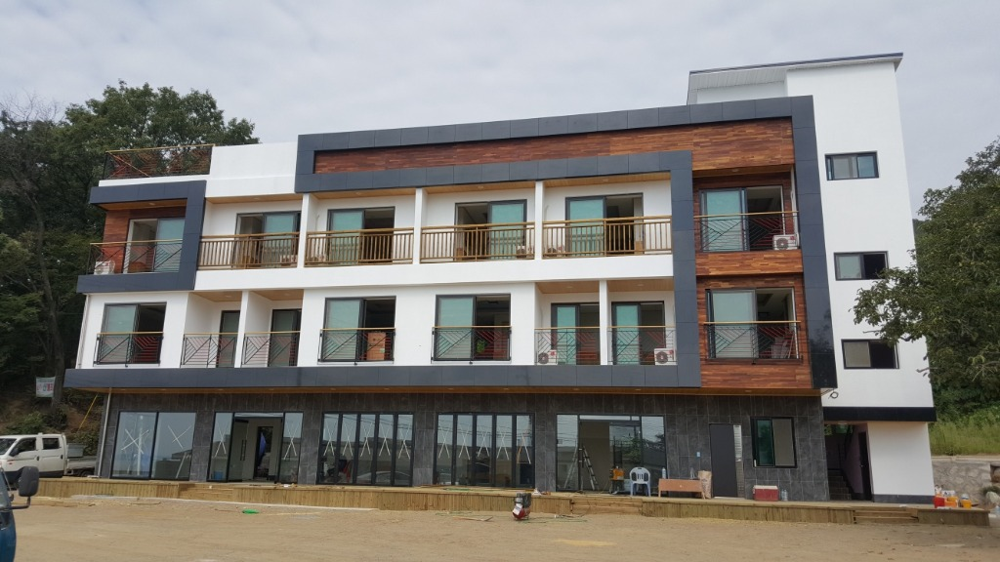
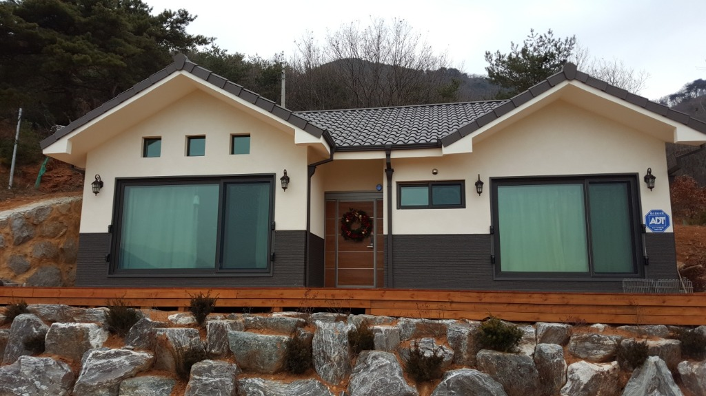
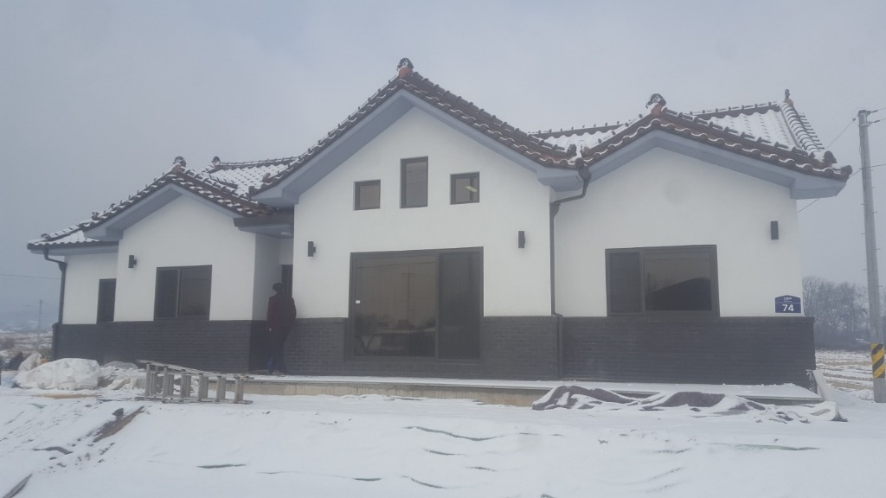
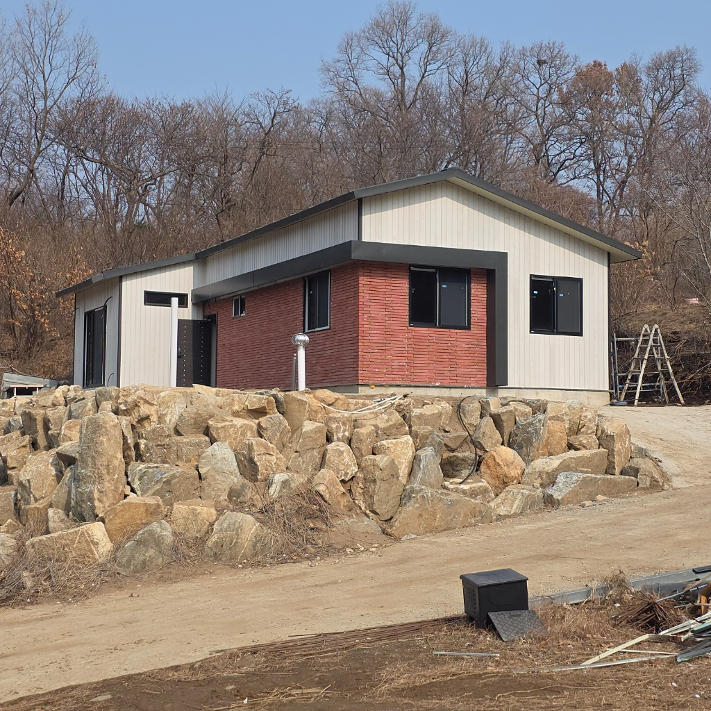
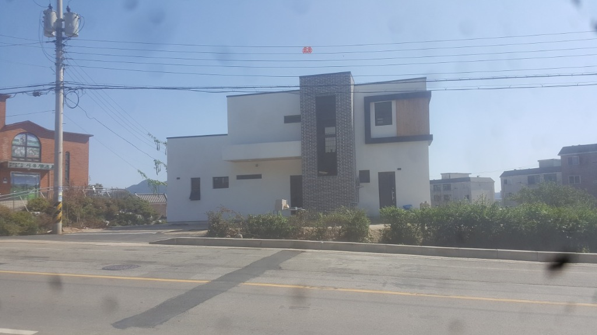
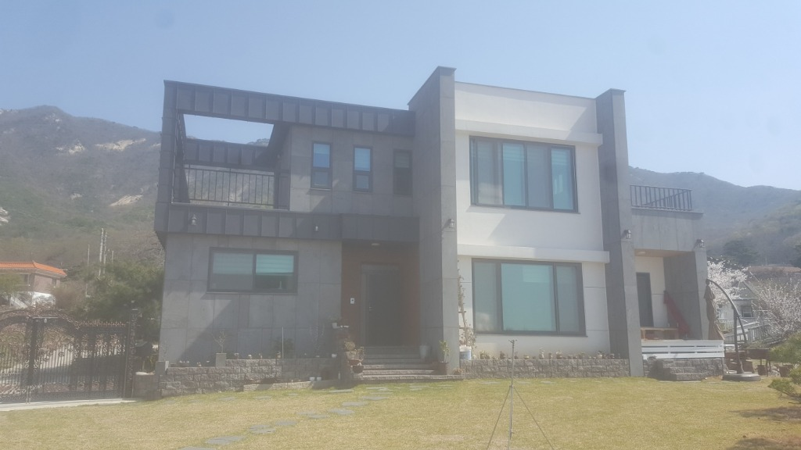

<!DOCTYPE html>
<html lang="ko">

<head>
    <meta charset="UTF-8">
    <meta name="viewport" content="width=device-width, initial-scale=1.0">
    <title>도원건축 | 프리미엄 단독주택 설계 및 시공</title>
    <meta name="description" content="단독주택 설계 및 시공을 전문으로 하는 도원건축입니다. 고급스러운 디자인과 노하우로 당신만의 공간을 창조합니다.">
    <link rel="stylesheet" href="style.css">
    <!-- Google Fonts: Noto Sans KR -->
    <link href="https://fonts.googleapis.com/css2?family=Noto+Sans+KR:wght@300;400;500;700&display=swap"
        rel="stylesheet">
    <!-- Font Awesome for Icons -->
    <link href="https://cdnjs.cloudflare.com/ajax/libs/font-awesome/6.0.0/css/all.min.css" rel="stylesheet">
</head>

<body>
    <!-- Navbar -->
    <nav class="navbar" id="navbar">
        

            <a href="#home" class="logo">도원건축</a>
            <ul class="nav-links">
                <li><a href="#home">홈</a></li>
                <li><a href="#about">소개</a></li>
                <li><a href="#portfolio">공간</a></li>
                <li><a href="#contact">문의</a></li>
            </ul>
            

                <i class="fas fa-bars"></i>
            

        

    </nav>

    <!-- Hero Section -->
    <section id="home" class="hero">
        

            
        

        

        

            <h1 class="hero-title">직접설계 직접시공</h1>
            
가장 완벽한 설계 및 시공 onestop service, 도원건축

            <a href="#about" class="btn btn-primary">자세히 보기</a>
        

        

            

                

            

            

        

    </section>

    <!-- About & Business Card Section -->
    <section id="about" class="about-section">
        

            

                <h2 class="section-title">건축에 진심을 담다</h2>
                

                

                    도원건축은 단순한 집을 짓는 것이 아닙니다. 
                    고객의 철학과 라이프스타일이 고스란히 담긴 <strong>'단 하나의 작품'</strong>을 만듭니다.
                

                

                    설계부터 시공까지 투명하고 완벽하게, 차별화된 디테일로 단독주택의 새로운 기준을 제시합니다.
                    마음을 움직이는 공간, 도원건축과 함께 시작하세요.
                

            

            

                <!-- Business Card -->
                

                    

                        

                            <h3 class="card-logo-text"><i class="fas fa-home"
                                    style="color: var(--accent); margin-right: 10px;"></i>도원건축</h3>
                            <h4 class="card-name">대표 김준영</h4>
                        

                        

                        <ul class="contact-list">
                            <li>
                                <i class="fas fa-phone-alt"></i>
                                010-2744-5604
                            </li>
                            <li>
                                <i class="fas fa-envelope"></i>
                                dowon9942@naver.com
                            </li>
                            <li>
                                <i class="fas fa-map-marker-alt"></i>
                                인천시 강화군 삼산면 삼산남로 72번길 48-20
                            </li>
                        </ul>
                        <a href="tel:01027445604" class="btn btn-outline btn-full">무료견적 상담하기</a>
                    

                

            

        

    </section>

    <!-- Portfolio Section -->
    <section id="portfolio" class="portfolio-section">
        

            

                <h2 class="section-title">시공사진</h2>
                

                
도원건축이 직접 시공한 현장의 생생한 모습을 확인하세요.

            

            

                

                    
                    

                        

                            <h3>신축 공사 현장 1</h3>
                            
시공 진행 중

                        

                    

                

                

                    
                    

                        

                            <h3>신축 공사 현장 2</h3>
                            
외관 작업 완료

                        

                    

                

                

                    
                    

                        

                            <h3>단독주택 시공 모습</h3>
                            
겨울철 현장 전경

                        

                    

                

                

                    
                    

                        

                            <h3>석모도 단독주택</h3>
                            
겨울현장 진행중

                        

                    

                

                

                    
                    

                        

                            <h3>현대식 주택</h3>
                            
모던 스타일 건축

                        

                    

                

                

                    
                    

                        

                            <h3>고급 단독주택 완공</h3>
                            
모던 하우스 전경

                        

                    

                

            

            

                <a href="#contact" class="btn btn-outline">프로젝트 의뢰하기</a>
            

        

    </section>

    <!-- Process Section -->
    <section class="process-section">
        

        

            

                <h2 class="section-title">투명하고 체계적인 진행</h2>
                

            

            

                

                    
<i class="fas fa-comments"></i>

                    <h3>1. 상담 및 기획</h3>
                    
전문가와의 심층 상담을 통해 고객의 니즈를 파악하고 예산에 맞는 기획을 수립합니다.

                

                

                    
<i class="fas fa-pencil-ruler"></i>

                    <h3>2. 맞춤형 설계</h3>
                    
독창적인 디자인과 실용성을 겸비한 최적의 설계 도면과 3D 모델링을 제공합니다.

                

                

                    
<i class="fas fa-hard-hat"></i>

                    <h3>3. 정밀 시공</h3>
                    
도원이 자랑하는 엄격한 품질 관리 하에 최고급 자재와 기술력으로 안전하게 시공합니다.

                

                

                    
<i class="fas fa-key"></i>

                    <h3>4. 완공 및 A/S</h3>
                    
입주 후에도 지속적인 관리와 신속한 A/S로 변함없는 만족을 약속드립니다.

                

            

        

    </section>

    <!-- Footer -->
    <footer id="contact" class="footer">
        

            

                

                    <h2 class="footer-logo">도원건축</h2>
                    
당신의 삶을 품격 있게 만드는 단독주택 전문 건축사무소

                    

                        <a href="#"><i class="fab fa-instagram"></i></a>
                        <a href="#"><i class="fab fa-youtube"></i></a>
                        <a href="#"><i class="fas fa-blog"></i></a>
                    

                

                

                    <h3>Contact Us</h3>
                    <ul>
                        <li><i class="fas fa-phone-alt"></i> <a href="tel:01027445604"
                                class="phone-link">010-2744-5604</a></li>
                        <li><i class="fas fa-envelope"></i> contact@dowon-arch.com</li>
                        <li><i class="fas fa-map-marker-alt"></i> 인천시 강화군 삼산면 삼산남로 72번길 48-20</li>
                    </ul>
                

                

                    <h3>Quick Links</h3>
                    <ul>
                        <li><a href="#home">홈</a></li>
                        <li><a href="#about">회사 소개</a></li>
                        <li><a href="#portfolio">포트폴리오</a></li>
                        <li><a href="#">개인정보처리방침</a></li>
                    </ul>
                

            

            

                
&copy; 2026 도원건축 (Dowon Architecture). All rights reserved.

            

        

    </footer>

    
</body>

</html># a
